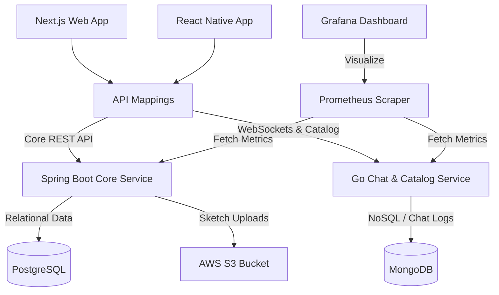

<div align="center">


# Aynısından isteyenlerin yeri!
### *Geleneksel el sanatlarının ve usta zanaatkârların güvenli pazar yeri platformu.*

<p align="center">
  
  
  
  
  <br/>
  
  
  
  
</p>

---

**Aynısından**, özel tasarım el emeği ürün yaptırmak isteyen müşteriler ile geleneksel sanatları yaşatan zanaatkârları (ahşap ustaları, seramikçiler, demirciler vb.) bir araya getiren modern bir pazar yeridir. Platform, **Param-Güvende** (escrow) ödeme garantisi, yapay zeka destekli eskiz geliştirme ve anlık mesajlaşma altyapılarını entegre ederek hem alıcı hem de satıcı için üst düzey bir güven sunar.

</div>

---

## 🏛️ Sistem Mimarisi ve Teknolojiler

Aynısından, yüksek performans, bağımsız ölçeklenebilirlik ve gözlemlenebilirlik odaklı **Mikroservis Mimarisi** ile tasarlanmıştır:



### ☕ 1. Core API Service (Java / Spring Boot)
*   **Görev:** Üyelik işlemleri, teklif yönetimi, sipariş durumları, Param-Güvende escrow ödeme iş akışları, iade ve değerlendirme süreçleri.
*   **Veritabanı:** PostgreSQL (İlişkisel ve finansal tutarlılık gerektiren veriler).
*   **Depolama:** AWS S3 (Müşteri eskizleri ve ürün fotoğrafları).
*   **Metrikler:** Micrometer + Prometheus Actuator.

### 🐹 2. Chat & Catalog Service (Go / Golang)
*   **Görev:** Gerçek zamanlı (WebSocket tabanlı) chat/mesajlaşma sistemi, portfolyo yönetimi ve zanaatkâr tamamlanan işler katalog akışı.
*   **Veritabanı:** MongoDB (Mesaj günlükleri ve esnek doküman yapısı gerektiren katalog verileri).
*   **Metrikler:** Prometheus Go Client Library.

### 🌐 3. Web Application (React / Next.js)
*   **Görev:** Müşteri ve Zanaatkâr panelleri, sipariş/teklif takibi, eskiz yükleme ve gerçek zamanlı sohbet arayüzleri.
*   **Stil:** Vanilla CSS & Tailwind.

### 📱 4. Mobile Application (React Native)
*   **Görev:** Zanaatkârların mobil cihazlardan anlık mesaj alabilmesi, teklif gönderebilmesi ve müşterilerin sipariş takibini mobil uygulamadan yapabilmesi.
*   **Altyapı:** Expo + TypeScript.

---

## 📂 Klasör Yapısı

```
aynisindan-workspace/
├── apps/
│   ├── web/                    # Next.js Web Uygulaması
│   └── mobile/                 # React Native (Expo) Mobil Uygulaması
├── services/
│   ├── core-service/           # Spring Boot (Java) Ana API Servisi
│   └── chat-catalog-service/   # Go (Golang) Mesajlaşma & Portfolyo Servisi
├── infrastructure/
│   ├── terraform/              # AWS IaC (VPC, EC2, RDS, S3, ECR) Kodları
│   ├── prometheus/             # Prometheus Scraper Yapılandırması
│   └── grafana/                # Grafana auto-provisioned Dashboards & Datasources
├── deploy.sh                   # Tek Tıkla Canlıya Dağıtım (Deploy) Scripti
├── docker-compose.yml          # Lokal Geliştirme (Full Stack) Compose Dosyası
└── docker-compose.prod.yml     # Sunucu (AWS) Üretim Ortamı Compose Dosyası
```

---

## 🛠️ Kurulum ve Lokal Çalıştırma

Tüm sistemi bilgisayarında hızlıca ayağa kaldırmak için Docker ve Docker Compose'un kurulu olması yeterlidir.

### 1. Ortam Değişkenleri
Kök dizinde bir `.env` dosyası oluşturun ve gerekli değişkenleri tanımlayın:
```env
AWS_ACCESS_KEY=your_aws_key
AWS_SECRET_KEY=your_aws_secret
AWS_S3_BUCKET=your_s3_bucket_name
AWS_REGION=eu-central-1
GEMINI_API_KEY_ENV=your_gemini_api_key
```

### 2. Tek Komutla Çalıştırma
Tüm veri tabanlarını, mikroservisleri, frontend'i ve izleme araçlarını başlatmak için:
```bash
make up
# veya
docker compose up --build
```

### 3. Erişim Noktaları (Lokal)
*   **Next.js Frontend:** [http://localhost:3000](http://localhost:3000)
*   **Spring Boot Backend:** [http://localhost:8080](http://localhost:8080)
*   **Go Chat & Catalog Service:** [http://localhost:8081](http://localhost:8081)
*   **Grafana Dashboard:** [http://localhost:3001](http://localhost:3001) (admin / admin)
*   **Prometheus Targets:** [http://localhost:9090](http://localhost:9090)

---

## 📊 İzleme ve Gözlemlenebilirlik (Observability)

Sistemde çalışan tüm servislerin performansı Prometheus tarafından kazınır ve Grafana üzerinde görselleştirilir.

*   **JVM Bellek Durumu (Heap/Non-Heap)**, GC çalışma sıklığı.
*   **Go Goroutine Sayıları** ve aktif WebSocket bağlantısı analizi.
*   **API Yanıt Süreleri (Percentiles - p50, p90, p99)**.
*   **HTTP 5xx Hata Oranları**.

*Aynısıdan Platform Metrics* panosu Grafana'da otomatik olarak yüklü gelir.

---

## ☁️ AWS Altyapısı ve Terraform (IaC)

Aynısından altyapısı AWS üzerinde tamamen kodla yönetilir (`infrastructure/terraform`):

*   **VPC:** İzole 2 adet Public, 2 adet Private Subnet.
*   **RDS PostgreSQL:** Sadece EC2 sunucusundan erişilebilen izole private database.
*   **Amazon S3:** Eskizlerin saklandığı güvenli obje deposu.
*   **Amazon ECR:** Mikroservislerin derlenmiş Docker imaj depoları.
*   **EC2:** Docker ve Docker Compose ile tüm stack'i koşturan sanal sunucu.

### Altyapıyı Kurmak İçin:
```bash
cd infrastructure/terraform
terraform init
terraform apply
```

---

## 🚀 Canlıya Dağıtım (Deployment)

Lokalde yaptığın kod değişikliklerini canlı sunucuya (`18.192.48.116`) tek komutla göndermek için hazırlanan otomasyon scriptini kullanabilirsin:

```bash
./deploy.sh
```
*Bu script; lokalinde linux/amd64 imajını derler, ECR'a push'lar, sunucudaki konfigürasyonları günceller ve kesintisiz (zero-downtime'a yakın) şekilde yayına alır.*

---

<div align="center">
  <p>💎 Aynısından isteyenlerin, işi ustasına bırakanların ortak adresi.</p>
</div>
